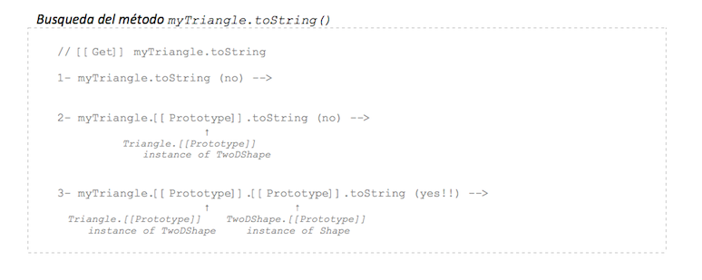
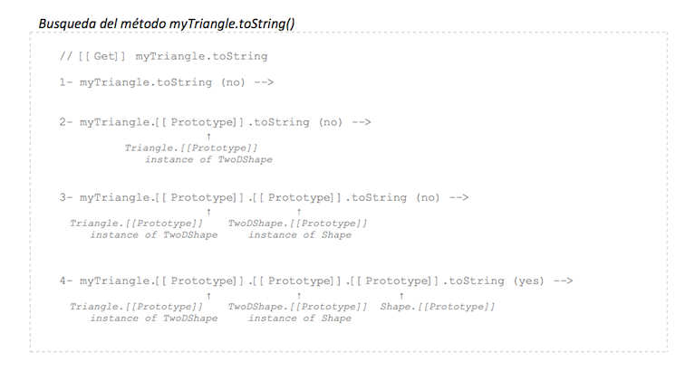
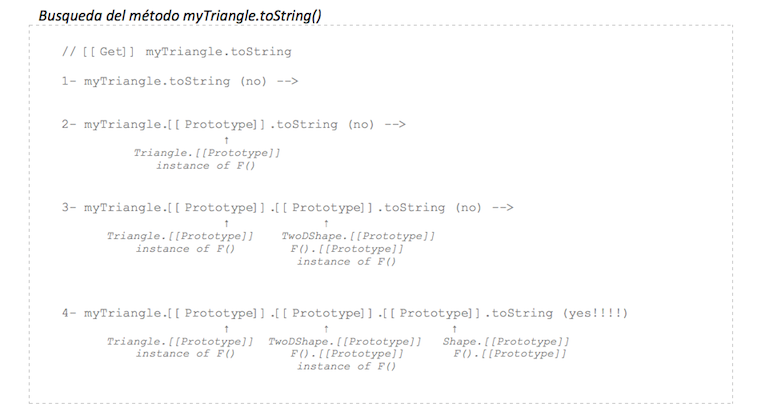

#Herencia

##Encadenamiento de Prototipos (Prototype Chaining)

Es el mecanismo por defecto que describe el standard ECMA para implementar la herencia
en Javascript

```javascript
function Shape(){
  this.name = 'shape';
  this.toString = function() {return this.name;};
}

function TwoDShape(){
  this.name = '2D shape';
}

function Triangle(side, height) {
  this.name = 'Triangle';
  this.side = side;
  this.height = height;
  this.getArea = function(){
    return this.side * this.height / 2;
  };
}

TwoDShape.prototype = new Shape();
Triangle.prototype = new TwoDShape();

TwoDShape.prototype.constructor = TwoDShape;
Triangle.prototype.constructor = Triangle;

>>> var myTriangle = new Triangle(5,10)

>>> myTriangle.getArea() === 25
true
>>> myTriangle.hasOwnProperty("getArea")
true

>>> myTriangle.toString() === "Triangle"
true
>>> myTriangle.hasOwnProperty("toString")
false

>>> myTriangle.constructor === Triangle
true

>>> myTriangle instanceof Shape
true
>>> myTriangle instanceof TwoDShape
true
>>> myTriangle instanceof Triangle
true

>>> Shape.prototype.isPrototypeOf(myTriangle)
true
>>> TwoDShape.prototype.isPrototypeOf(myTriangle)
true
>>> Triangle.prototype.isPrototypeOf(myTriangle)
true

>>> String.prototype.isPrototypeOf(myTriangle)
false
```


  
  
```javascript
>>> TwoDShape.prototype.hasOwnProperty("toString")
true
>>> Shape.prototype.hasOwnProperty("toString")
false
>>> myTriangle.hasOwnProperty("getArea")
true
>>> Triangle.prototype.hasOwnProperty("getArea")
false

>>> var td = new TwoDShape();

>>> td.constructor === TwoDShape
true
>>> td.toString() === "2D shape"
true

>>> var s = new Shape()

>>> s.constructor === Shape
true
>>> s.toString() === "shape"
true
```

Se recomienda mover a los prototipos todas las propiedades/métodos _reutilizables_, y
dejar las _no-­reutilizables_ como propias de las instancias

<br/>

##Moviendo metodos re-utilizables al prototypo

```javascript
function Shape(){}

// augment prototype
Shape.prototype.name = 'shape';
Shape.prototype.toString = function() {
  return this.name;
};

function TwoDShape(){}

// take care of inheritance
TwoDShape.prototype = new Shape();
TwoDShape.prototype.constructor = TwoDShape;

// augment prototype
TwoDShape.prototype.name = '2D shape';

function Triangle(side, height) {
  this.side = side;
  this.height = height;
}

// take care of inheritance
Triangle.prototype = new TwoDShape();
Triangle.prototype.constructor = Triangle;

// augment prototype
Triangle.prototype.name = 'Triangle';
Triangle.prototype.getArea = function(){
  return this.side * this.height / 2;
};

var myTriangle = new Triangle(5,10)

```

  

```javascript
>>> TwoDShape.prototype.hasOwnProperty("toString")
false
>>> Shape.prototype.hasOwnProperty("toString")
true
>>> myTriangle.hasOwnProperty("getArea")
false
>>> Triangle.prototype.hasOwnProperty("getArea")
```
<br/>

##Herencia sólo del prototipo

Es un mecanismo más eficiente ya que no se crean nuevas instancias sólo para implementar
la herencia

La búsqueda por la cadena de prototipos es más rápida (ya que no hay cadena de
prototipos, todos los prototipos apuntan al mismo objeto )

```javascript
function Shape(){}

// augment prototype
Shape.prototype.name = 'shape';
Shape.prototype.toString = function() {
  return this.name;
};

function TwoDShape(){}

// take care of inheritance
TwoDShape.prototype = Shape.prototype;
TwoDShape.prototype.constructor = TwoDShape;

// augment prototype
TwoDShape.prototype.name = '2D shape';

function Triangle(side, height) {
  this.side = side;
  this.height = height;
}

// take care of inheritance
Triangle.prototype = TwoDShape.prototype;
Triangle.prototype.constructor = Triangle;

// augment prototype
Triangle.prototype.name = 'Triangle';
Triangle.prototype.getArea = function(){return this.side * this.height /
2;}
```

  

```javascript
>>> Triangle.prototype.hasOwnProperty("getArea")
true
>>> Shape.prototype.hasOwnProperty("getArea")
true
>>> Shape.prototype.hasOwnProperty("toString")
true
>>> Triangle.prototype.hasOwnProperty("toString")
true
```

El problema de este método es que al apuntar todos los prototipos al mismo objeto,
cuando modificamos alguno de los prototipos, los modificamos todos.

```javascript
>>> Triangle.prototype.name = 'Triangle';
>>> var s = new Shape()
>>> s.name
"Triangle"
```

<br/>

##Función constructora temporal _F()_

Para solucionar esto podemos usar una **función constructora temporal F()** vacia y
asignarle a su prototype el prototipo de la función constructora padre

De esta manera podemos hacer `new F()` y crear objetos que no tengan propiedades por si
mismos pero que hereden todo del `prototype` del padre

```javascript
function Shape(){}

// augment prototype
Shape.prototype.name = 'shape';
Shape.prototype.toString = function() {return this.name;};

function TwoDShape(){}

// take care of inheritance
var F = function(){};
F.prototype = Shape.prototype;
TwoDShape.prototype = new F();
TwoDShape.prototype.constructor = TwoDShape;

// augment prototype
TwoDShape.prototype.name = '2D shape';

function Triangle(side, height) {
  this.side = side;
  this.height = height;
}

// take care of inheritance
var F = function(){};
F.prototype = TwoDShape.prototype;
Triangle.prototype = new F();
Triangle.prototype.constructor = Triangle;

// augment prototype
Triangle.prototype.name = 'Triangle';
Triangle.prototype.getArea = function(){return this.side * this.height /
2;};

>>> var myTriangle = new Triangle(5, 10);
>>> myTriangle.getArea() === 25
true
>>> myTriangle.toString() === "Triangle"
true

>>> var myShape = new Shape()
>>> myShape.name === "shape"
True

>>> Triangle.prototype.name = "super-Triangle"
>>> myTriangle.name === "super-Triangle"
true
>>> myShape.name === "shape"
true
```

  
  
```javascript
>>> myTriangle.__proto__.__proto__.__proto__.constructor === Shape
true
>>> myTriangle.__proto__.__proto__.constructor === TwoDShape
true

>>> myTriangle.__proto__.constructor === Triangle
true
```

<br/>

##Encapsulando la herencia en una función

Podemos encapsular este código en una función extend que nos facilite implementar la herencia

```javascript
function extend(Child, Parent) {
  var F = function(){};
  F.prototype = Parent.prototype;
  Child.prototype = new F();
  Child.prototype.constructor = Child;
}

function Shape(){};
// augment prototype
Shape.prototype.name = 'shape';
Shape.prototype.toString = function() {return this.name;};

function TwoDShape(){};
extend(TwoDShape, Shape);
TwoDShape.prototype.name = '2D shape';

function Triangle(side, height) {
  this.side = side;
  this.height = height;
}
extend(Triangle, TwoDShape);
Triangle.prototype.name = 'Triangle';
Triangle.prototype.getArea = function(){return this.side * this.height /
2;};

>>> var myTriangle = new Triangle(5, 10);
>>> myTriangle.getArea() === 25
true
>>> myTriangle.toString() === "Triangle"
true

>>> Triangle.prototype.hasOwnProperty("getArea")
true
>>> Shape.prototype.hasOwnProperty("getArea")
false
>>> Shape.prototype.hasOwnProperty("toString")
true
>>> Triangle.prototype.hasOwnProperty("toString")
false
```

<br/>

##Robando el _constructor_

Otro patrón para implementar la herencia es llamando al constructor padre desde el constructor hijo mediante `apply` o `call`.

De esta manera las propiedades del padre son _recreadas_ como propias en el hijo (son
valores nuevos, no referencias a objetos)

```javascript
function Shape(id) {
  this.id = id;
}
Shape.prototype.name = 'shape';
Shape.prototype.toString = function(){return this.name;};

function Triangle() {
  Shape.apply(this, arguments);
}
Triangle.prototype = new Shape();
Triangle.prototype.name = 'Triangle';

>>> var myTriangle = new Triangle(101)
>>> myTriangle.name === "Triangle"
true
>>> myTriangle.toString() === "Triangle"
true
>>> myTriangle.hasOwnProperty("name")
false
>>> myTriangle.hasOwnProperty("id")
true
>>> myTriangle.hasOwnProperty("toString")
false
```